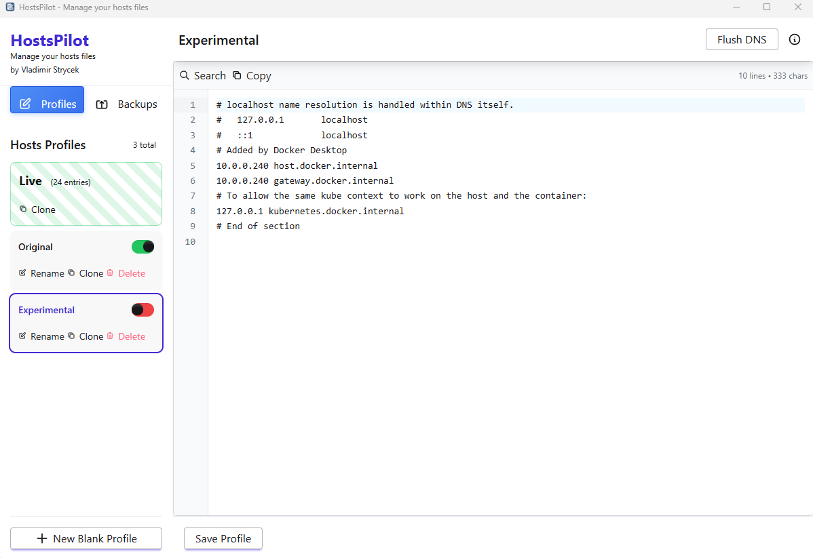

# HostsPilot

<div align="center">


**A modern, secure Windows desktop application for managing and switching between multiple hosts file profiles with ease.**

[](https://opensource.org/licenses/MIT)
[](https://tauri.app/)
[](https://www.rust-lang.org/)
[](https://svelte.dev/)

[Features](#-features) • [Installation](#-installation) • [Tech Stack](#-technology-stack) • [Security](#-security-information) • [License](#-license)

</div>

---

## 📸 Screenshot



*Modern, intuitive interface with profile management, live hosts view, and integrated code editor*

---

## 📖 Overview

**HostsPilot** is a professional-grade hosts file manager designed for developers, system administrators, and power users who need to manage multiple network configurations efficiently. Built with modern web technologies and Rust, it provides a secure, fast, and intuitive interface for managing Windows hosts files.

### What is a Hosts File?

The hosts file (`C:\Windows\System32\drivers\etc\hosts`) maps hostnames to IP addresses, allowing you to:
- Block unwanted websites
- Redirect domains to local development servers
- Test websites before DNS propagation
- Create custom network configurations

### Why HostsPilot?

- **🚀 Fast & Lightweight** - Native performance with minimal resource usage (~5-6 MB)
- **🔒 Secure** - Built with Rust for memory safety and security
- **🎨 Modern UI** - Beautiful, responsive interface with smooth animations
- **💾 Safe Operations** - Automatic backups before every change
- **⚡ One-Click Switching** - Instantly switch between different configurations
- **🔄 Profile Management** - Organize unlimited host configurations

---

## ✨ Features

### Core Functionality

#### 📝 **Professional Code Editor**
- Powered by CodeMirror 6
- Syntax-aware editing
- Line numbers and highlighting
- Search functionality (Ctrl+F)
- Auto-completion for common entries
- Copy to clipboard

#### 👤 **Profile Management**
- Create unlimited profiles
- Clone existing profiles
- Rename and delete profiles
- Visual profile cards with entry counts
- Color-coded active profile indicator
- Live system hosts view with animated background

#### 🔄 **Smart Activation System**
- One-click profile activation via toggle switches
- Automatic DNS cache flushing
- Instant apply for active profile edits
- Visual feedback (green = active, red = inactive)
- No manual file copying required

#### 💾 **Backup & Restore**
- Automatic backups on every activation
- Manual backup creation
- View backup contents before restoring
- Restore backups as new profiles
- Automatic cleanup (keeps 25 most recent)
- Timestamped backup names

#### 🗑️ **Backup Management**
- Individual backup deletion
- Bulk delete all backups
- Backup list with shortened names
- Full backup name on hover
- Organized by date/time

#### ⚙️ **System Integration**
- Automatic admin rights elevation
- DNS cache flush integration
- System tray support
- Windows 7/8/10/11 compatibility
- No installation required (portable)

---

## 🛠️ Technology Stack

### Frontend

| Technology | Version | Purpose |
|------------|---------|---------|
| **Svelte** | 5.0.0 | Reactive UI framework |
| **SvelteKit** | 2.0.0 | Application framework |
| **TypeScript** | 5.0.0 | Type-safe JavaScript |
| **TailwindCSS** | 3.4.0 | Utility-first CSS framework |
| **DaisyUI** | 4.12.0 | Component library |
| **CodeMirror** | 6.0.0 | Code editor component |
| **Vite** | 5.0.0 | Build tool and dev server |

### Backend

| Technology | Version | Purpose |
|------------|---------|---------|
| **Rust** | 1.70+ | Core application logic |
| **Tauri** | 2.0.0 | Desktop application framework |
| **Serde** | 1.0 | Serialization/deserialization |
| **Chrono** | 0.4 | Date and time handling |
| **Dirs** | 5.0 | Cross-platform directory paths |

### Build Tools

| Tool | Version | Purpose |
|------|---------|---------|
| **Node.js** | 18+ | JavaScript runtime |
| **npm** | 9+ | Package manager |
| **Cargo** | Latest | Rust package manager |
| **embed-resource** | 2.4 | Windows resource embedding |

### Development Dependencies

```json
{
  "@sveltejs/adapter-static": "^3.0.0",
  "@sveltejs/kit": "^2.0.0",
  "@sveltejs/vite-plugin-svelte": "^4.0.0",
  "@tauri-apps/cli": "^2.0.0",
  "autoprefixer": "^10.4.16",
  "postcss": "^8.4.32",
  "svelte": "^5.0.0",
  "tailwindcss": "^3.4.0",
  "typescript": "^5.0.0",
  "vite": "^5.0.0"
}
```

---

## 🔒 Security Information

### Security Features

- **Memory Safety**: Built with Rust, preventing common vulnerabilities like buffer overflows
- **Sandboxed Frontend**: Web content runs in isolated WebView2 environment
- **No Network Access**: Application operates entirely offline
- **Automatic Backups**: Every change creates a backup for recovery
- **Admin Rights Required**: Explicit elevation for system file modifications
- **No Telemetry**: Zero data collection or external communication

### File Locations

| Type | Location |
|------|----------|
| **System Hosts** | `C:\Windows\System32\drivers\etc\hosts` |
| **Profiles** | `%AppData%\HostsPilot\profiles\` |
| **Backups** | `%AppData%\HostsPilot\backups\` |
| **Active Profile** | `%AppData%\HostsPilot\.active_profile` |

### Permissions Required

- **Administrator Rights**: Required to modify system hosts file
- **File System Access**: Read/write to AppData directory
- **Process Execution**: For DNS cache flush (`ipconfig /flushdns`)

### Code Signing

The application executable is not currently code-signed. For enterprise deployment, consider:
- Internal code signing with your organization's certificate
- Hash verification before deployment
- Running from trusted network locations

### Audit Information

- **Source Code**: Open source, available for security review
- **Build Process**: Reproducible builds with documented dependencies
- **No External Dependencies at Runtime**: All dependencies bundled
- **WebView2**: Uses Microsoft's Edge WebView2 (system component)

---

## 📥 Installation

### Option 1: Portable Executable (Recommended)

1. Download `hostspilot.exe` from releases
2. Double-click to run (UAC prompt will appear)
3. Application launches with admin rights
4. No installation required

### Option 2: Installer

1. Download `HostsPilot_x.x.x_x64-setup.exe`
2. Run installer
3. Follow installation wizard
4. Launch from Start Menu or Desktop shortcut

### System Requirements

- **OS**: Windows 7 SP1 or later (Windows 10/11 recommended)
- **WebView2**: Automatically installed on Windows 10/11
- **RAM**: 50 MB minimum
- **Disk**: 10 MB for application + space for profiles/backups
- **Privileges**: Administrator rights required

---

## 🚀 Usage

### Quick Start

1. **Launch Application** - Double-click exe (UAC prompt appears)
2. **View Live Hosts** - See current system hosts file
3. **Create Profile** - Click "New Blank Profile" or clone existing
4. **Edit Profile** - Use the code editor to modify entries
5. **Activate Profile** - Toggle switch to activate
6. **DNS Flush** - Automatic after activation

### Creating a Profile

```
1. Click "New Blank Profile"
2. Enter profile name (e.g., "Development")
3. Add your hosts entries:
   127.0.0.1    local.example.com
   127.0.0.1    dev.mysite.com
4. Click "Save Profile"
5. Toggle switch to activate
```

### Managing Backups

```
1. Switch to "Backups" tab
2. View list of automatic backups
3. Click backup to view contents
4. Click "Restore Backup" to create profile from backup
5. Use "Delete All Backups" to clean up (keeps 25 most recent)
```

---

## 🏗️ Building from Source

### Prerequisites

```bash
# Install Node.js 18+ and Rust
# Windows: Install Visual Studio Build Tools

# Verify installations
node --version
npm --version
cargo --version
```

### Build Steps

```bash
# Clone repository
git clone https://github.com/VladoPortos/hostspilot.git
cd hostspilot

# Install dependencies
npm install

# Development mode
npm run tauri dev

# Production build
npm run tauri build

# Output: src-tauri/target/release/hostspilot.exe
```

For detailed build instructions, see [BUILD_GUIDE.md](BUILD_GUIDE.md)

---

## 👨‍💻 Author

**Vladimir Strycek**

- GitHub: [@VladoPortos](https://github.com/VladoPortos)
- Repository: [github.com/VladoPortos/hostspilot](https://github.com/VladoPortos/hostspilot)

---

## 📄 License

This project is licensed under the **MIT License with Attribution Requirement**.

### MIT License

Copyright (c) 2025 Vladimir Strycek

Permission is hereby granted, free of charge, to any person obtaining a copy
of this software and associated documentation files (the "Software"), to deal
in the Software without restriction, including without limitation the rights
to use, copy, modify, merge, publish, distribute, sublicense, and/or sell
copies of the Software, and to permit persons to whom the Software is
furnished to do so, subject to the following conditions:

**The above copyright notice and this permission notice shall be included in all
copies or substantial portions of the Software.**

### Additional Attribution Requirement for Commercial Use

If you use this software in a commercial product or service, you must:

1. **Provide Attribution**: Include a visible credit to "HostsPilot by Vladimir Strycek" in your product's about/credits section
2. **Link to Repository**: Include a link to https://github.com/VladoPortos/hostspilot
3. **Preserve Copyright**: Keep all copyright notices intact in source code

**Example Attribution:**
```
This product uses HostsPilot by Vladimir Strycek
https://github.com/VladoPortos/hostspilot
```

### Disclaimer

THE SOFTWARE IS PROVIDED "AS IS", WITHOUT WARRANTY OF ANY KIND, EXPRESS OR
IMPLIED, INCLUDING BUT NOT LIMITED TO THE WARRANTIES OF MERCHANTABILITY,
FITNESS FOR A PARTICULAR PURPOSE AND NONINFRINGEMENT. IN NO EVENT SHALL THE
AUTHORS OR COPYRIGHT HOLDERS BE LIABLE FOR ANY CLAIM, DAMAGES OR OTHER
LIABILITY, WHETHER IN AN ACTION OF CONTRACT, TORT OR OTHERWISE, ARISING FROM,
OUT OF OR IN CONNECTION WITH THE SOFTWARE OR THE USE OR OTHER DEALINGS IN THE
SOFTWARE.

---

## 🤝 Contributing

Contributions are welcome! Please feel free to submit a Pull Request.

### Development Setup

1. Fork the repository
2. Create your feature branch (`git checkout -b feature/AmazingFeature`)
3. Commit your changes (`git commit -m 'Add some AmazingFeature'`)
4. Push to the branch (`git push origin feature/AmazingFeature`)
5. Open a Pull Request

---

## 📞 Support

- **Issues**: [GitHub Issues](https://github.com/VladoPortos/hostspilot/issues)
- **Discussions**: [GitHub Discussions](https://github.com/VladoPortos/hostspilot/discussions)

---

## 🙏 Acknowledgments

- **Tauri Team** - For the amazing desktop framework
- **Svelte Team** - For the reactive UI framework
- **CodeMirror** - For the excellent code editor
- **Rust Community** - For the robust programming language

---

<div align="center">

**Made with ❤️ by Vladimir Strycek**

⭐ Star this repository if you find it helpful!

</div>
